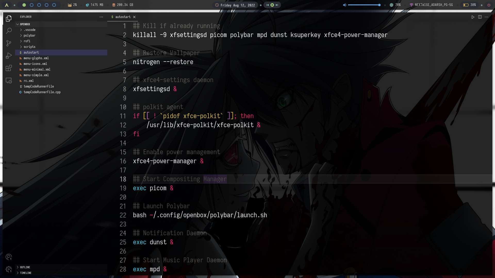

## This autostart files includes all the programs that need to  start executing on system startup like picom , nitrogen etc.

### Location:

 This file needs to be located with the .config folder, further inside the config folder of your distribution.
 
Eg. ~/.config/openbox/autostart.sh

